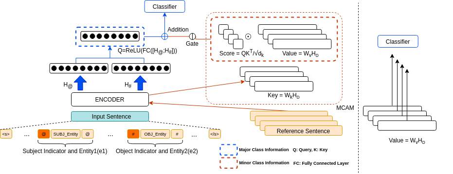

# Enhancing Targeted Minority Class Prediction in Sentence-Level Relation Extraction

**PyTorch implementation of our paper: [Enhancing Targeted Minority Class Prediction in Sentence-Level Relation Extraction](https://www.mdpi.com/1424-8220/22/13/4911)**



## Environments
- python (3.8.8)
- cuda (11.4)

## Requirements
- torch (1.8.0)
- transformers (4.6.1)
- sklearn

## TACRED
- Please refer to `tacred` dir

## Generating synthetic data
- Please refer to `syn_gen` dir

## Citation
```bibtex
@Article{s22134911,
AUTHOR = {Baek, Hyeong-Ryeol and Choi, Yong-Suk},
TITLE = {Enhancing Targeted Minority Class Prediction in Sentence-Level Relation Extraction},
JOURNAL = {Sensors},
VOLUME = {22},
YEAR = {2022},
NUMBER = {13},
ARTICLE-NUMBER = {4911},
URL = {https://www.mdpi.com/1424-8220/22/13/4911},
ISSN = {1424-8220},
ABSTRACT = {Sentence-level relation extraction (RE) has a highly imbalanced data distribution that about 80% of data are labeled as negative, i.e., no relation; and there exist minority classes (MC) among positive labels; furthermore, some of MC instances have an incorrect label. Due to those challenges, i.e., label noise and low source availability, most of the models fail to learn MC and get zero or very low F1 scores on MCs. Previous studies, however, have rather focused on micro F1 scores and MCs have not been addressed adequately. To tackle high mis-classification errors for MCs, we introduce (1) a minority class attention module (MCAM), and (2) effective augmentation methods specialized in RE. MCAM calculates the confidence scores on MC instances to select reliable ones for augmentation, and aggregates MCs information in the process of training a model. Our experiments show that our methods achieve a state-of-the-art F1 scores on TACRED as well as enhancing minority class F1 score dramatically.},
DOI = {10.3390/s22134911}
}
```
